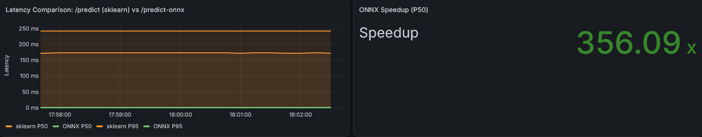

# Medical Text Classifier API
[](https://python.org)
[](https://fastapi.tiangolo.com)
[](https://docker.com)
[](https://grafana.com/)
[](https://prometheus.io/)

## Decisão Arquitetural Hipotética

### Estratégia de Deploy: AWS (Amazon Web Services)

**Justificativa da escolha AWS:**

1. **ECS Fargate para API Real-time:**
   - Serverless container management
   - Auto-scaling baseado em métricas
   - Integração nativa com CloudWatch e ALB
   - Baixa latência para inferência (< 100ms)

2. **S3 para Storage de Modelos:**
   - Versionamento de modelos
   - Alta durabilidade (99.999999999%)
   - Custo-efetivo para modelos pequenos

3. **MWAA (Managed Workflows for Apache Airflow):**
   - Orquestração gerenciada
   - Sem overhead de infraestrutura
   - Integração com serviços AWS

### Arquitetura Híbrida (Batch + Real-time)

**Real-time Inference (API):**
- API FastAPI em ECS Fargate
- Load Balancer para distribuição
- Auto-scaling baseado em CPU/RPS
- Latência alvo: < 100ms

**Batch Processing (Training):**
- Airflow DAG para pipeline de treino
- Execução diária/semanal
- Modelo treinado salvo no S3
- Atualização do modelo em produção

### Justificativa da Arquitetura

1. **Latência Crítica:** Classificação de urgência médica requer resposta rápida
2. **Volume Variável:** Hospital pode ter picos de demanda
3. **Custo-Efetividade:** Serverless quando possível, containers quando necessário
4. **Compliance:** AWS tem certificações HIPAA

# Instalação e uso

```bash
# Clone o repositório
git clone https://github.com/bluheart/fiap-tech-challenge-fase-3.git
cd fiap-tech-challenge-fase-3

# setup do airflow, espere finalizar
docker compose up airflow-init

# configura o resto dos containers
docker compose up -d

# Aguarde os containers ficarem prontos
# Acesse o Airflow, Vá em dags e clique em Trigger para rodar a DAG que vai gerar o modelo
# Acesse a API e faça uma requisição POST para o endpoint reload_model para carregar o modelo gerado pela DAG (é mais facil fazer essa requisição pelo /docs)
# Faça uma requisição POST para o endpoint convert_to_onnx para gerar o modelo otimizado (também pelo /docs)

# Acesse:
# - Airflow     http://localhost:8080 (admin/senha nos logs do container airflow-apiserver)
# - API:        http://localhost:8000
# - Docs:       http://localhost:8000/docs
# - Prometheus: http://localhost:9090
# - Grafana:    http://localhost:3000 (admin/admin)
```

# Testes

```bash
# endpoint predict
curl -X POST "http://localhost:8000/predict"
   -H "accept: application/json"
   -H "Content-Type: application/json"
   -d '{\"text\": \"paciente esta com dor no peito\"}'

# endpoint predict-onnx
curl -X POST "http://localhost:8000/predict-onnx"
   -H "accept: application/json"
   -H "Content-Type: application/json"
   -d '{\"text\": \"paciente esta com dor no peito\"}'

# endpoint benchmark compara as duas predicts
curl -X POST "http://localhost:8000/benchmark"
   -H "accept: application/json"
   -H "Content-Type: application/json"
   -d '{\"text\": \"paciente esta com dor no peito\"}'
```
## Teste de latência e comparação

```bash
# Em uma janela do terminal
yes | xargs -P 10 -I {} curl -s -X POST "http://localhost:8000/predict" \
    -H "Content-Type: application/json" \
    -d '{"text": "paciente esta com dor no peito"}' > /dev/null

# Em outra janela do terminal
yes | xargs -P 10 -I {} curl -s -X POST "http://localhost:8000/predict-onnx" \
    -H "Content-Type: application/json" \
    -d '{"text": "paciente esta com dor no peito"}' > /dev/null
```
Resultando em (Você pode reproduzir o teste e acompanhar pelo dashboard do Grafana)
